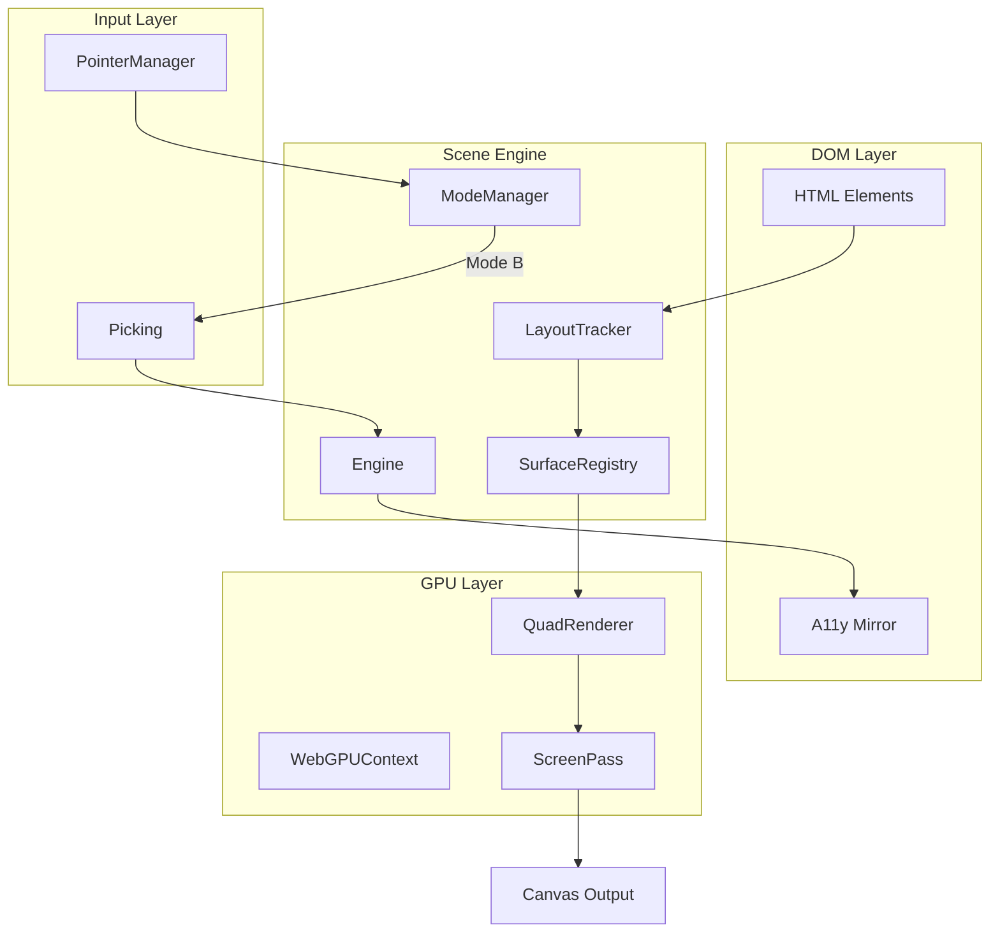

# Scene Engine Implementation Plan

## Suggested Spec Improvements

Before implementation, consider these additions to [SCENE_SPEC.md](SCENE_SPEC.md):

### 1. Add WebGPU Fallback Strategy

The spec should explicitly state the graceful degradation approach:

- Detect WebGPU availability at initialization
- Scene still mounts and tracks DOM, but skips GPU rendering
- All motion callbacks still fire (for non-GPU animations)
- `scene.isGPUEnabled` flag for conditional logic

### 2. Add Missing Technical Details

**Layout Tracking Strategy:**

- Use `ResizeObserver` for element size changes
- Use `IntersectionObserver` for visibility culling
- Use `MutationObserver` for DOM structure changes
- Batch rect updates per frame via RAF

**Canvas Sizing:**

- Match `devicePixelRatio` for retina displays
- Canvas fills viewport, positioned fixed behind DOM

**GhostSurface Capture:**

- Use `element.getBoundingClientRect()` for position
- For texture: rasterize via OffscreenCanvas + `drawImage` or capture last rendered GPU state

### 3. Add Error Boundaries

- Timeout for `ready` callback in navigation transitions (default 5s)
- Fallback behavior when GPU context is lost
- Event: `scene.on('error', handler)`

### 4. Clarify Motion Binding API

```ts
surface.bind('distortion', motionValue) // reactive binding
surface.set('distortion', 0.5)          // static value
```

---

## Repo Structure (Refined)

```
scene/
├─ packages/
│  ├─ core/           # Engine, EventBus, ModeManager, RAF Scheduler
│  ├─ renderer/       # WebGPU context, QuadRenderer, ShaderLibrary
│  ├─ surfaces/       # SurfaceRegistry, LayoutTracker, GhostSurface
│  ├─ screen/         # EffectStack, TransitionShaders
│  ├─ input/          # PointerManager, Inertia, Picking
│  ├─ navigation/     # TransitionCoordinator
│  └─ a11y/           # DOMMirror, FocusSync
│
├─ demos/
│  └─ carousel/       # Vanilla JS demo
│
├─ tsconfig.json
├─ package.json       # pnpm workspace
└─ SCENE_SPEC.md
```

---

## Implementation Phases

### Phase 1: Monorepo Foundation

Set up the development environment and core infrastructure.

- Initialize pnpm workspace with TypeScript
- Configure Vite for building packages
- Set up shared tsconfig, ESLint, Prettier
- Create `@scene/core` package skeleton with:
  - `Engine` class (owns render loop, mode, registries)
  - `EventBus` (typed event emitter)
  - `RAFScheduler` (batched requestAnimationFrame)

### Phase 2: WebGPU Renderer

Build the GPU rendering foundation.

- Create `@scene/renderer` package:
  - `WebGPUContext` - adapter/device initialization with availability check
  - `QuadRenderer` - renders textured quads for surfaces
  - `ScreenPass` - fullscreen post-processing pass
  - `ShaderLibrary` - WGSL shader management
- Graceful degradation: expose `isAvailable` flag, no-op when unavailable

### Phase 3: Surface System ✅

**Status:** COMPLETE (January 7, 2026)  
**Log:** [Phase 3 Completion](../logs/builds/phase-3-surfaces/COMPLETE.md)

Track DOM elements and prepare them for GPU augmentation.

- ✅ Create `@scene/surfaces` package:
  - ✅ `Surface` class - links DOM element to GPU representation
  - ✅ `SurfaceRegistry` - manages all surfaces by ID
  - ✅ `LayoutTracker` - ResizeObserver + IntersectionObserver integration
  - ✅ `GhostSurface` - temporary GPU-only surface from DOM snapshot
- ✅ Batch layout updates per frame
- ✅ Build successful (14.45 kB, 3.84 kB gzipped)
- ✅ Test page created and verified

### Phase 4: Screen Effects ✅

**Status:** COMPLETE (January 12, 2026)  
**Log:** [Phase 4 Completion](../logs/builds/phase-4-screen/COMPLETE.md)

Implement fullscreen post-processing pipeline.

- ✅ Create `@scene/screen` package:
  - ✅ `EffectStack` - ordered list of post-process effects
  - ✅ Built-in effects: blur, vignette, chromatic aberration
  - ✅ Transition shaders for navigation (dissolve, wipe, fade-to-black, zoom)
  - ✅ `TransitionEffect` - manages navigation transitions
- ✅ Build successful (19.99 kB, 4.71 kB gzipped)
- ✅ Test pages created and verified

### Phase 5: Input System ✅

**Status:** COMPLETE (January 12, 2026)  
**Log:** [Phase 5 Completion](../../builds/phase-5-input/COMPLETE.md)

Handle pointer input for Canvas-Interactive mode.

- ✅ Create `@scene/input` package:
  - ✅ `PointerManager` - normalized pointer events
  - ✅ `Inertia` - momentum/deceleration for drag gestures
  - ✅ `Picking` - CPU ray-plane intersection for surface hit testing
  - ✅ `InputManager` - high-level coordinator with Engine integration
- ✅ Mode handling via Engine's existing mode system
- ✅ Build successful (20.75 kB, 5.08 kB gzipped)
- ✅ Test page created and verified

### Phase 6: Navigation Transitions ✅

**Status:** COMPLETE (January 14, 2026)  
**Log:** [Phase 6 Completion](../builds/phase-6-navigation/COMPLETE.md)

Coordinate visual continuity during route changes.

- ✅ Create `@scene/navigation` package:
  - ✅ `TransitionCoordinator` - implements the transition protocol
  - ✅ Ghost surface creation/destruction lifecycle
  - ✅ Timeout handling with configurable duration
  - ✅ Cancellation support with AbortSignal
  - ✅ Lifecycle event emission
- ✅ Build successful
- ✅ Test pages created and verified

### Phase 7: Accessibility Layer ✅

**Status:** COMPLETE (January 16, 2026)  
**Log:** [Phase 7 Completion](../builds/phase-7-a11y/COMPLETE.md)

Ensure screen readers and keyboard navigation work.

- ✅ Create `@scene/a11y` package:
  - ✅ `DOMMirror` - creates accessible DOM elements for canvas objects
  - ✅ `FocusSync` - syncs focus between DOM mirror and canvas state
  - ✅ `LiveAnnouncer` - ARIA live regions for state changes
  - ✅ `A11yManager` - high-level coordinator with Engine integration
- ✅ Build successful (19.47 kB, 4.82 kB gzipped)
- ✅ Test page created and verified

### Phase 8: 3D Carousel Demo

Build the proof-of-concept demo from the spec.

- Vanilla JS demo in `demos/carousel/`
- Carousel with 5-7 cards arranged in 3D arc
- Drag/scroll to rotate
- Center card detection and forward pop
- Click to activate with dissolve transition
- Keyboard navigation (arrow keys, Enter)

---

## Key Architecture Decisions



---

## Files to Create First

1. `package.json` - pnpm workspace config
2. `tsconfig.json` - shared TypeScript config
3. `packages/core/src/index.ts` - Engine entry point
4. `packages/core/src/Engine.ts` - main Scene class
5. `packages/core/src/EventBus.ts` - typed events
6. `packages/core/src/RAFScheduler.ts` - render loop
7. `packages/renderer/src/WebGPUContext.ts` - GPU initialization
